#Summary 

##Capacity plots

The capacity plots show the fraction of retrieved patterns vs the number of patterns. The fraction was calculated with 10 trials of the experiment. In the experiment, a random pattern of a given network was perturbed by 20%. Then, the dynamics function was applied on the perturbed pattern to see if it converges back to the original pattern. The fraction shows how many patterns converged in 10 trials. One can see that the bigger the network size, the smaller is the fraction of retrieved patterns.

###Hebbian rule

|    |   network_size | weight_rule   |   num_perturb |   match_frac |
|---:|---------------:|:--------------|--------------:|-------------:|
|  0 |             10 | hebbian       |             2 |          1   |
|  1 |             10 | hebbian       |             2 |          1   |
|  2 |             10 | hebbian       |             2 |          1   |
|  3 |             10 | hebbian       |             2 |          0.7 |
|  4 |             10 | hebbian       |             2 |          0.7 |
|  5 |             10 | hebbian       |             2 |          0.9 |
|  6 |             10 | hebbian       |             2 |          0.5 |
|  7 |             10 | hebbian       |             2 |          0.5 |
|  8 |             10 | hebbian       |             2 |          0.4 |
|  9 |             10 | hebbian       |             2 |          0   |

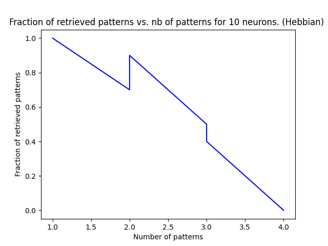

|    |   network_size | weight_rule   |   num_perturb |   match_frac |
|---:|---------------:|:--------------|--------------:|-------------:|
|  0 |             18 | hebbian       |             3 |          1   |
|  1 |             18 | hebbian       |             3 |          1   |
|  2 |             18 | hebbian       |             3 |          1   |
|  3 |             18 | hebbian       |             3 |          0.8 |
|  4 |             18 | hebbian       |             3 |          0.9 |
|  5 |             18 | hebbian       |             3 |          0.6 |
|  6 |             18 | hebbian       |             3 |          0.8 |
|  7 |             18 | hebbian       |             3 |          0.5 |
|  8 |             18 | hebbian       |             3 |          0.4 |
|  9 |             18 | hebbian       |             3 |          0   |

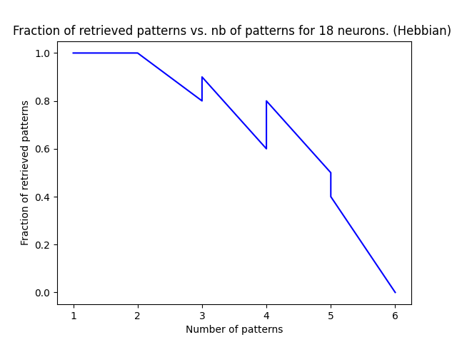

|    |   network_size | weight_rule   |   num_perturb |   match_frac |
|---:|---------------:|:--------------|--------------:|-------------:|
|  0 |             34 | hebbian       |             6 |          1   |
|  1 |             34 | hebbian       |             6 |          1   |
|  2 |             34 | hebbian       |             6 |          1   |
|  3 |             34 | hebbian       |             6 |          0.9 |
|  4 |             34 | hebbian       |             6 |          0.9 |
|  5 |             34 | hebbian       |             6 |          0.5 |
|  6 |             34 | hebbian       |             6 |          0.4 |
|  7 |             34 | hebbian       |             6 |          0.4 |
|  8 |             34 | hebbian       |             6 |          0.5 |
|  9 |             34 | hebbian       |             6 |          0.1 |

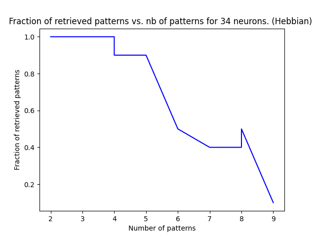

|    |   network_size | weight_rule   |   num_perturb |   match_frac |
|---:|---------------:|:--------------|--------------:|-------------:|
|  0 |             63 | hebbian       |            12 |          1   |
|  1 |             63 | hebbian       |            12 |          1   |
|  2 |             63 | hebbian       |            12 |          1   |
|  3 |             63 | hebbian       |            12 |          0.7 |
|  4 |             63 | hebbian       |            12 |          0.9 |
|  5 |             63 | hebbian       |            12 |          0.7 |
|  6 |             63 | hebbian       |            12 |          0.4 |
|  7 |             63 | hebbian       |            12 |          0.1 |
|  8 |             63 | hebbian       |            12 |          0.1 |
|  9 |             63 | hebbian       |            12 |          0.1 |

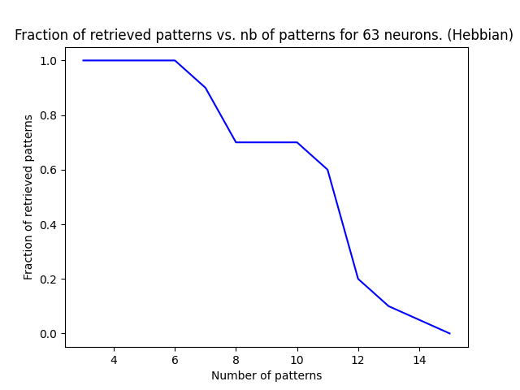

|    |   network_size | weight_rule   |   num_perturb |   match_frac |
|---:|---------------:|:--------------|--------------:|-------------:|
|  0 |            116 | hebbian       |            23 |          1   |
|  1 |            116 | hebbian       |            23 |          1   |
|  2 |            116 | hebbian       |            23 |          1   |
|  3 |            116 | hebbian       |            23 |          0.9 |
|  4 |            116 | hebbian       |            23 |          0.8 |
|  5 |            116 | hebbian       |            23 |          1   |
|  6 |            116 | hebbian       |            23 |          0.2 |
|  7 |            116 | hebbian       |            23 |          0.1 |
|  8 |            116 | hebbian       |            23 |          0.1 |
|  9 |            116 | hebbian       |            23 |          0.1 |

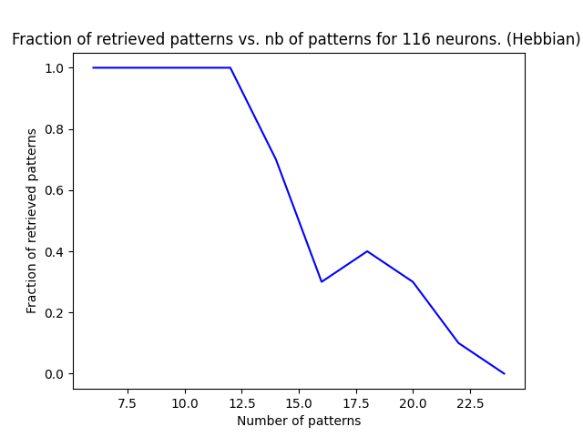

|    |   network_size | weight_rule   |   num_perturb |   match_frac |
|---:|---------------:|:--------------|--------------:|-------------:|
|  0 |            215 | hebbian       |            43 |          1   |
|  1 |            215 | hebbian       |            43 |          1   |
|  2 |            215 | hebbian       |            43 |          0.9 |
|  3 |            215 | hebbian       |            43 |          0.9 |
|  4 |            215 | hebbian       |            43 |          0.9 |
|  5 |            215 | hebbian       |            43 |          0.5 |
|  6 |            215 | hebbian       |            43 |          0.3 |
|  7 |            215 | hebbian       |            43 |          0.1 |
|  8 |            215 | hebbian       |            43 |          0.3 |
|  9 |            215 | hebbian       |            43 |          0   |

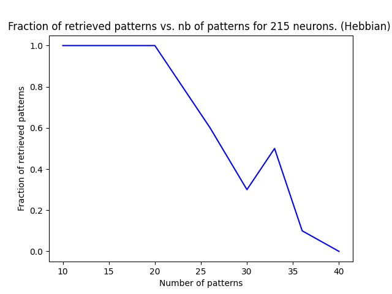

|    |   network_size | weight_rule   |   num_perturb |   match_frac |
|---:|---------------:|:--------------|--------------:|-------------:|
|  0 |            397 | hebbian       |            79 |          1   |
|  1 |            397 | hebbian       |            79 |          1   |
|  2 |            397 | hebbian       |            79 |          1   |
|  3 |            397 | hebbian       |            79 |          0.9 |
|  4 |            397 | hebbian       |            79 |          0.9 |
|  5 |            397 | hebbian       |            79 |          0.4 |
|  6 |            397 | hebbian       |            79 |          0.3 |
|  7 |            397 | hebbian       |            79 |          0.4 |
|  8 |            397 | hebbian       |            79 |          0.1 |
|  9 |            397 | hebbian       |            79 |          0   |

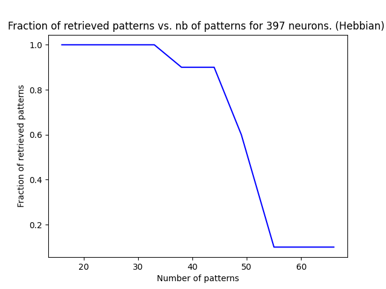

|    |   network_size | weight_rule   |   num_perturb |   match_frac |
|---:|---------------:|:--------------|--------------:|-------------:|
|  0 |            733 | hebbian       |           146 |          1   |
|  1 |            733 | hebbian       |           146 |          1   |
|  2 |            733 | hebbian       |           146 |          1   |
|  3 |            733 | hebbian       |           146 |          1   |
|  4 |            733 | hebbian       |           146 |          0.7 |
|  5 |            733 | hebbian       |           146 |          0.8 |
|  6 |            733 | hebbian       |           146 |          0.3 |
|  7 |            733 | hebbian       |           146 |          0.6 |
|  8 |            733 | hebbian       |           146 |          0.2 |
|  9 |            733 | hebbian       |           146 |          0   |

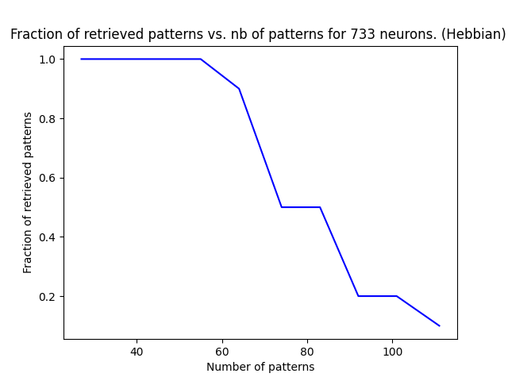

|    |   network_size | weight_rule   |   num_perturb |   match_frac |
|---:|---------------:|:--------------|--------------:|-------------:|
|  0 |           1354 | hebbian       |           270 |          1   |
|  1 |           1354 | hebbian       |           270 |          1   |
|  2 |           1354 | hebbian       |           270 |          1   |
|  3 |           1354 | hebbian       |           270 |          1   |
|  4 |           1354 | hebbian       |           270 |          0.8 |
|  5 |           1354 | hebbian       |           270 |          0.3 |
|  6 |           1354 | hebbian       |           270 |          0.3 |
|  7 |           1354 | hebbian       |           270 |          0.1 |
|  8 |           1354 | hebbian       |           270 |          0.1 |
|  9 |           1354 | hebbian       |           270 |          0   |

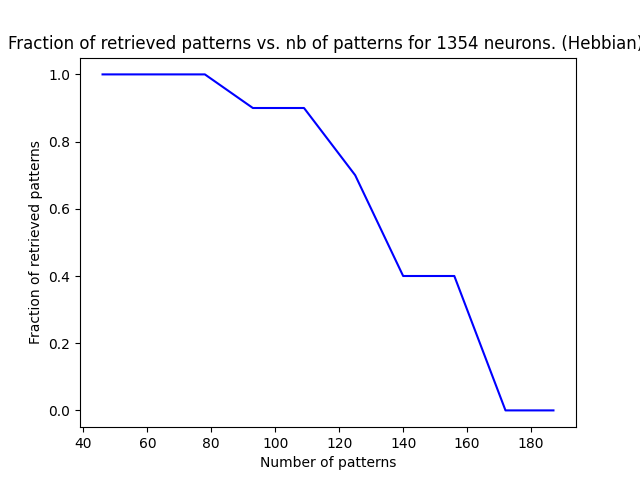

|    |   network_size | weight_rule   |   num_perturb |   match_frac |
|---:|---------------:|:--------------|--------------:|-------------:|
|  0 |           2500 | hebbian       |           500 |          1   |
|  1 |           2500 | hebbian       |           500 |          1   |
|  2 |           2500 | hebbian       |           500 |          1   |
|  3 |           2500 | hebbian       |           500 |          0.9 |
|  4 |           2500 | hebbian       |           500 |          0.9 |
|  5 |           2500 | hebbian       |           500 |          0.4 |
|  6 |           2500 | hebbian       |           500 |          0.4 |
|  7 |           2500 | hebbian       |           500 |          0.1 |
|  8 |           2500 | hebbian       |           500 |          0   |
|  9 |           2500 | hebbian       |           500 |          0   |

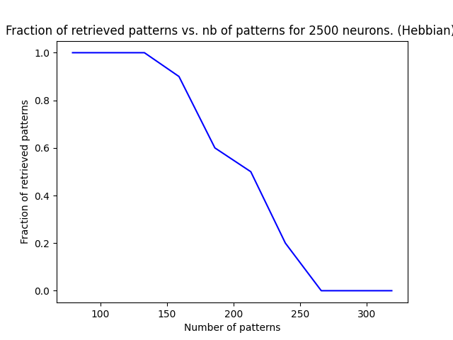

###Storkey rule

|    |   network_size | weight_rule   |   num_perturb |   match_frac |
|---:|---------------:|:--------------|--------------:|-------------:|
|  0 |             10 | storkey       |             2 |          0.8 |
|  1 |             10 | storkey       |             2 |          0.8 |
|  2 |             10 | storkey       |             2 |          0.9 |
|  3 |             10 | storkey       |             2 |          0.6 |
|  4 |             10 | storkey       |             2 |          0.4 |
|  5 |             10 | storkey       |             2 |          0.2 |
|  6 |             10 | storkey       |             2 |          0.2 |
|  7 |             10 | storkey       |             2 |          0.2 |
|  8 |             10 | storkey       |             2 |          0.3 |
|  9 |             10 | storkey       |             2 |          0.2 |

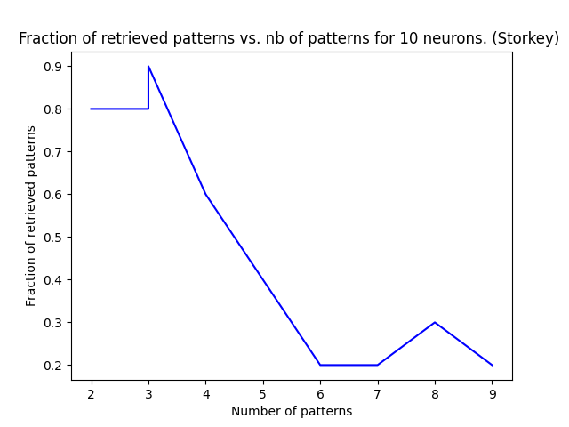

|    |   network_size | weight_rule   |   num_perturb |   match_frac |
|---:|---------------:|:--------------|--------------:|-------------:|
|  0 |             18 | storkey       |             3 |          1   |
|  1 |             18 | storkey       |             3 |          0.9 |
|  2 |             18 | storkey       |             3 |          0.9 |
|  3 |             18 | storkey       |             3 |          0.5 |
|  4 |             18 | storkey       |             3 |          0.7 |
|  5 |             18 | storkey       |             3 |          0.6 |
|  6 |             18 | storkey       |             3 |          0.3 |
|  7 |             18 | storkey       |             3 |          0.2 |
|  8 |             18 | storkey       |             3 |          0.1 |
|  9 |             18 | storkey       |             3 |          0   |

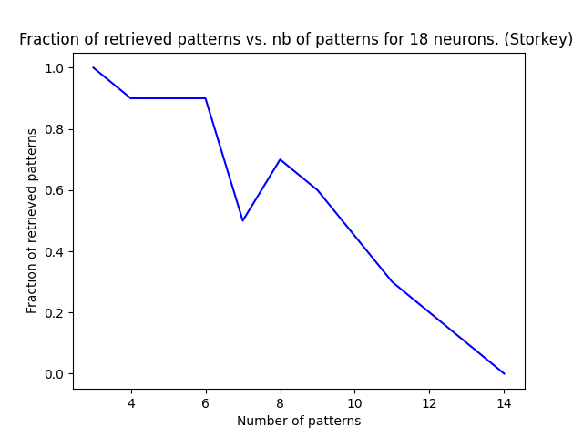

|    |   network_size | weight_rule   |   num_perturb |   match_frac |
|---:|---------------:|:--------------|--------------:|-------------:|
|  0 |             34 | storkey       |             6 |          1   |
|  1 |             34 | storkey       |             6 |          0.8 |
|  2 |             34 | storkey       |             6 |          0.6 |
|  3 |             34 | storkey       |             6 |          0.7 |
|  4 |             34 | storkey       |             6 |          0.5 |
|  5 |             34 | storkey       |             6 |          0.3 |
|  6 |             34 | storkey       |             6 |          0   |
|  7 |             34 | storkey       |             6 |          0.1 |
|  8 |             34 | storkey       |             6 |          0   |
|  9 |             34 | storkey       |             6 |          0.1 |

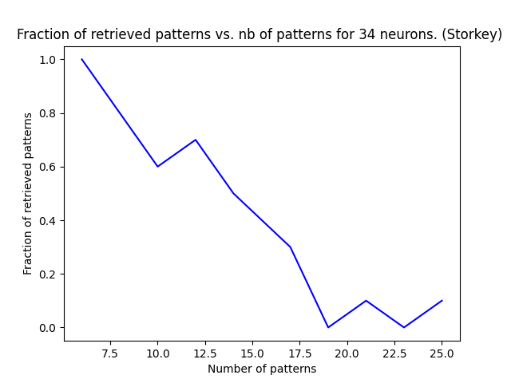

|    |   network_size | weight_rule   |   num_perturb |   match_frac |
|---:|---------------:|:--------------|--------------:|-------------:|
|  0 |             63 | storkey       |            12 |          1   |
|  1 |             63 | storkey       |            12 |          0.8 |
|  2 |             63 | storkey       |            12 |          0.8 |
|  3 |             63 | storkey       |            12 |          0.5 |
|  4 |             63 | storkey       |            12 |          0.4 |
|  5 |             63 | storkey       |            12 |          0.1 |
|  6 |             63 | storkey       |            12 |          0.1 |
|  7 |             63 | storkey       |            12 |          0.1 |
|  8 |             63 | storkey       |            12 |          0   |
|  9 |             63 | storkey       |            12 |          0   |

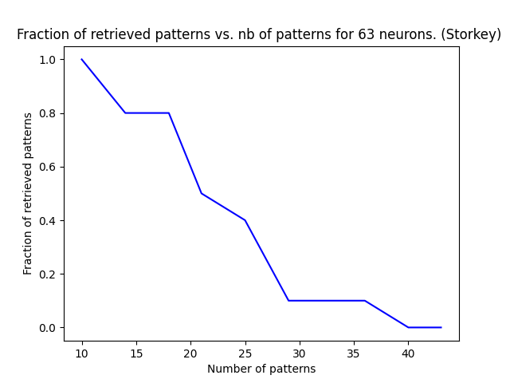

|    |   network_size | weight_rule   |   num_perturb |   match_frac |
|---:|---------------:|:--------------|--------------:|-------------:|
|  0 |            116 | storkey       |            23 |          1   |
|  1 |            116 | storkey       |            23 |          0.9 |
|  2 |            116 | storkey       |            23 |          0.8 |
|  3 |            116 | storkey       |            23 |          0.4 |
|  4 |            116 | storkey       |            23 |          0.2 |
|  5 |            116 | storkey       |            23 |          0   |
|  6 |            116 | storkey       |            23 |          0   |
|  7 |            116 | storkey       |            23 |          0   |
|  8 |            116 | storkey       |            23 |          0   |
|  9 |            116 | storkey       |            23 |          0   |

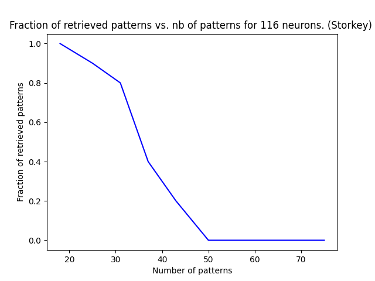

|    |   network_size | weight_rule   |   num_perturb |   match_frac |
|---:|---------------:|:--------------|--------------:|-------------:|
|  0 |            215 | storkey       |            43 |          1   |
|  1 |            215 | storkey       |            43 |          1   |
|  2 |            215 | storkey       |            43 |          1   |
|  3 |            215 | storkey       |            43 |          0.5 |
|  4 |            215 | storkey       |            43 |          0.3 |
|  5 |            215 | storkey       |            43 |          0   |
|  6 |            215 | storkey       |            43 |          0   |
|  7 |            215 | storkey       |            43 |          0   |
|  8 |            215 | storkey       |            43 |          0   |
|  9 |            215 | storkey       |            43 |          0   |

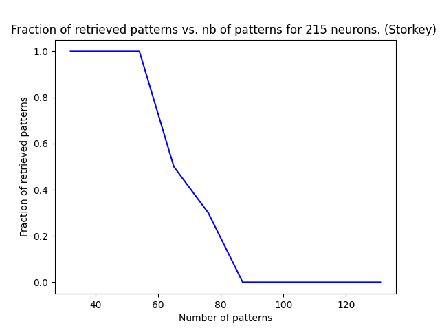

|    |   network_size | weight_rule   |   num_perturb |   match_frac |
|---:|---------------:|:--------------|--------------:|-------------:|
|  0 |            397 | storkey       |            79 |          1   |
|  1 |            397 | storkey       |            79 |          1   |
|  2 |            397 | storkey       |            79 |          1   |
|  3 |            397 | storkey       |            79 |          0.8 |
|  4 |            397 | storkey       |            79 |          0.2 |
|  5 |            397 | storkey       |            79 |          0   |
|  6 |            397 | storkey       |            79 |          0   |
|  7 |            397 | storkey       |            79 |          0   |
|  8 |            397 | storkey       |            79 |          0   |
|  9 |            397 | storkey       |            79 |          0   |

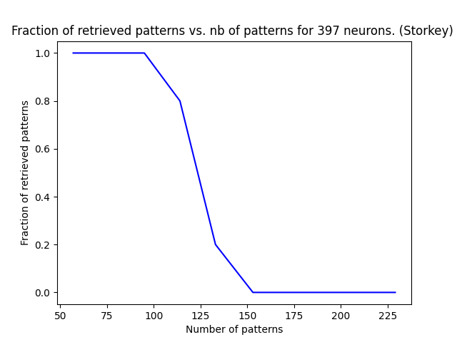

##Robustness curves

The robustness curves show the fraction of retrieved patterns vs the number of perturbations in percentage. Each network consists of 2 patterns and a varying number of neurons. The initial perturbation of 0% was gradually increased by 5% until 100%. The robustness curves show how much one can perturb a pattern until it will not converge anymore.

###Hebbian rule

|    |   network_size | weight_rule   |   num_perturb |   match_frac |
|---:|---------------:|:--------------|--------------:|-------------:|
|  0 |             10 | hebbian       |             2 |          0.8 |

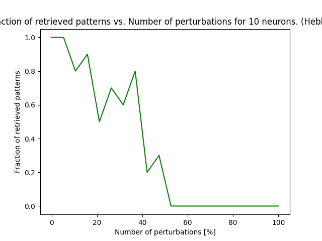

|    |   network_size | weight_rule   |   num_perturb |   match_frac |
|---:|---------------:|:--------------|--------------:|-------------:|
|  0 |             18 | hebbian       |             7 |          0.7 |

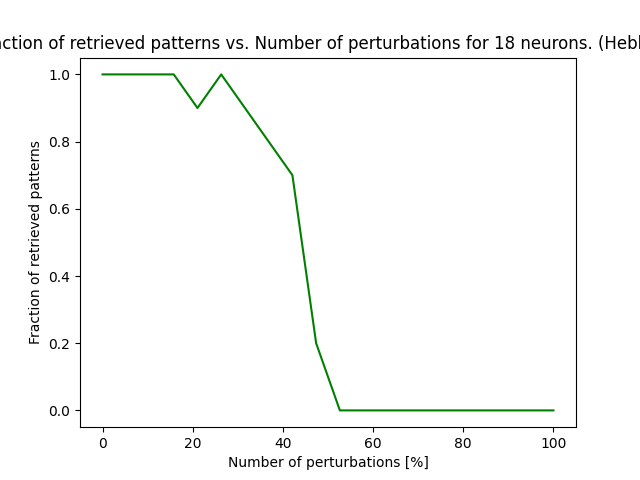

|    |   network_size | weight_rule   |   num_perturb |   match_frac |
|---:|---------------:|:--------------|--------------:|-------------:|
|  0 |             34 | hebbian       |            13 |          0.7 |

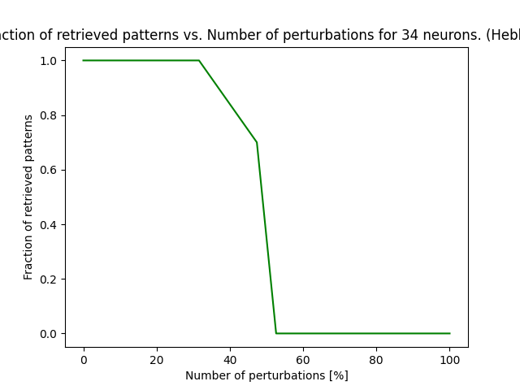

|    |   network_size | weight_rule   |   num_perturb |   match_frac |
|---:|---------------:|:--------------|--------------:|-------------:|
|  0 |             63 | hebbian       |            28 |          0.8 |

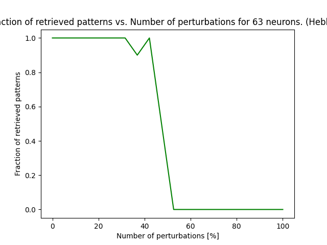

|    |   network_size | weight_rule   |   num_perturb |   match_frac |
|---:|---------------:|:--------------|--------------:|-------------:|
|  0 |            116 | hebbian       |            52 |          0.7 |

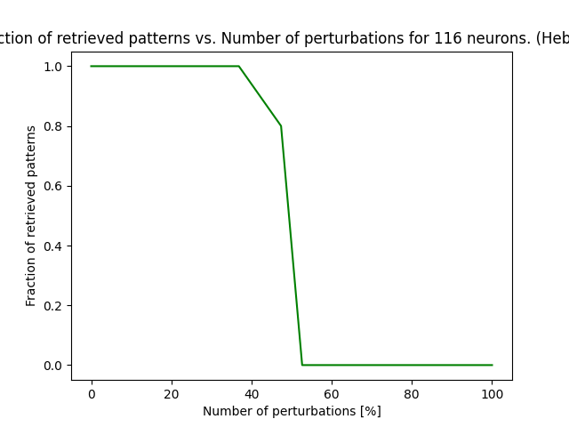

|    |   network_size | weight_rule   |   num_perturb |   match_frac |
|---:|---------------:|:--------------|--------------:|-------------:|
|  0 |            215 | hebbian       |            96 |          0.8 |

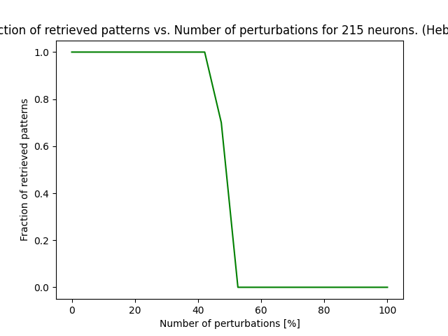

|    |   network_size | weight_rule   |   num_perturb |   match_frac |
|---:|---------------:|:--------------|--------------:|-------------:|
|  0 |            397 | hebbian       |           198 |            0 |

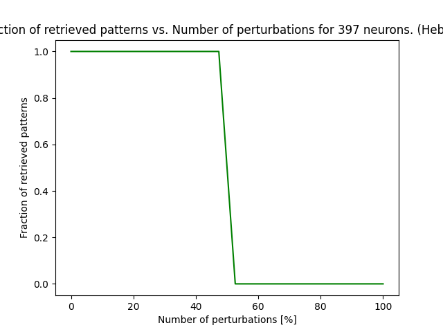

|    |   network_size | weight_rule   |   num_perturb |   match_frac |
|---:|---------------:|:--------------|--------------:|-------------:|
|  0 |            733 | hebbian       |           366 |            0 |

|    |   network_size | weight_rule   |   num_perturb |   match_frac |
|---:|---------------:|:--------------|--------------:|-------------:|
|  0 |           1354 | hebbian       |           676 |          0.1 |

|    |   network_size | weight_rule   |   num_perturb |   match_frac |
|---:|---------------:|:--------------|--------------:|-------------:|
|  0 |           2500 | hebbian       |          1249 |          0.1 |

###Storkey rule

|    |   network_size | weight_rule   |   num_perturb |   match_frac |
|---:|---------------:|:--------------|--------------:|-------------:|
|  0 |             10 | storkey       |             2 |          0.8 |

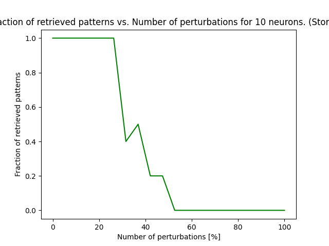

|    |   network_size | weight_rule   |   num_perturb |   match_frac |
|---:|---------------:|:--------------|--------------:|-------------:|
|  0 |             18 | storkey       |             6 |          0.8 |

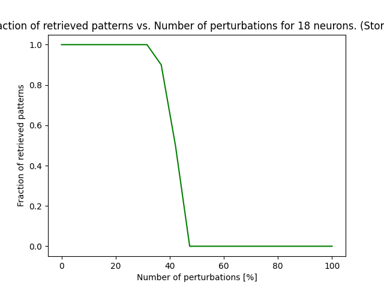

|    |   network_size | weight_rule   |   num_perturb |   match_frac |
|---:|---------------:|:--------------|--------------:|-------------:|
|  0 |             34 | storkey       |            13 |          0.7 |

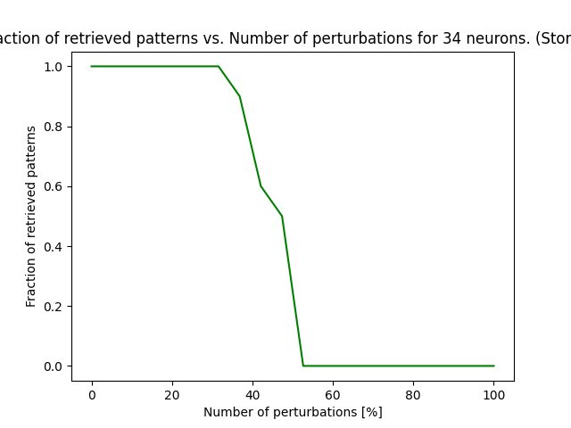

|    |   network_size | weight_rule   |   num_perturb |   match_frac |
|---:|---------------:|:--------------|--------------:|-------------:|
|  0 |             63 | storkey       |            25 |          0.7 |

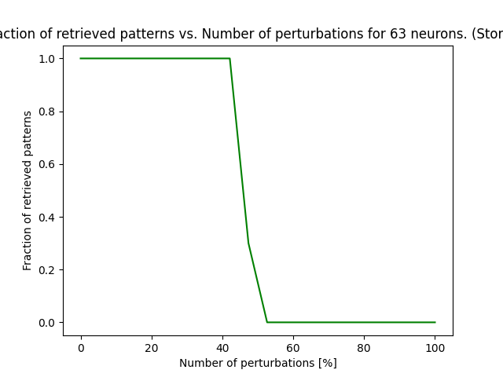

|    |   network_size | weight_rule   |   num_perturb |   match_frac |
|---:|---------------:|:--------------|--------------:|-------------:|
|  0 |            116 | storkey       |            52 |          0.8 |

|    |   network_size | weight_rule   |   num_perturb |   match_frac |
|---:|---------------:|:--------------|--------------:|-------------:|
|  0 |            215 | storkey       |            96 |          0.8 |

|    |   network_size | weight_rule   |   num_perturb |   match_frac |
|---:|---------------:|:--------------|--------------:|-------------:|
|  0 |            397 | storkey       |           198 |            0 |

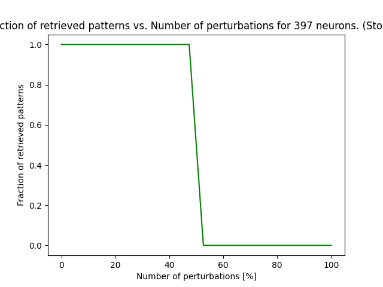

##Network capacity

The network capacity was estimated by executing the experiment in a total of 10 trials. If all 10 patterns converged, the capacity was increased by one. Therefore, the estimated capacity represents the number of patterns that were retrieved with a probability of 90% or higher (they converge). The following plot compares the estimated capacity (red) to the theoretical capacity (green).

Capacity law for Storkey rule and Hebbian rule are different so plots will be different.

###Hebbian rule

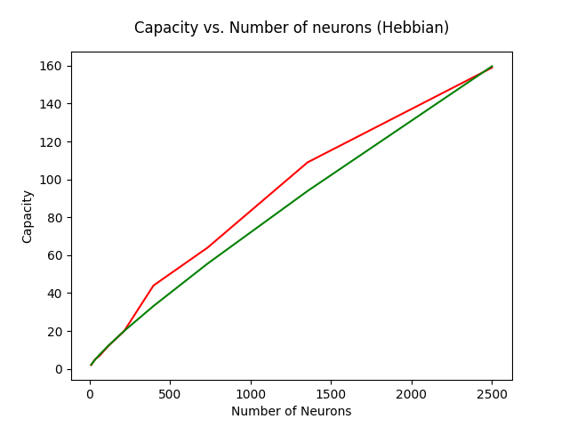

###Storkey rule 

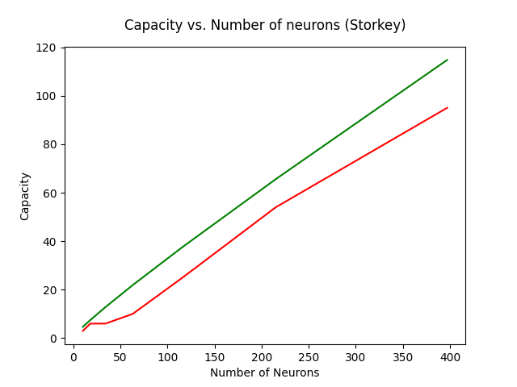

##Maximum perturbation graphs

The maximum perturbation graphs show what perturbation percentage is the maximum for a network of 2 patterns and varying size of neurons. If one surpasses this limit, the perturbed pattern will not be able to converge back to the initially memorized pattern.

###Hebbian rule

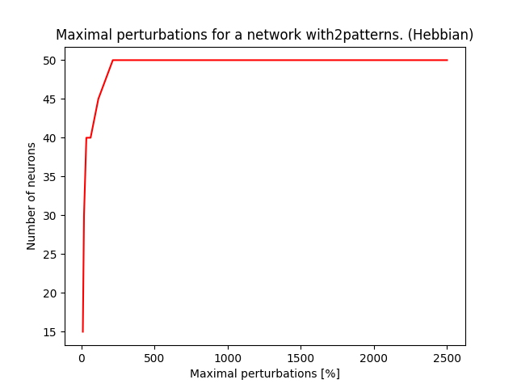

###Storkey rule

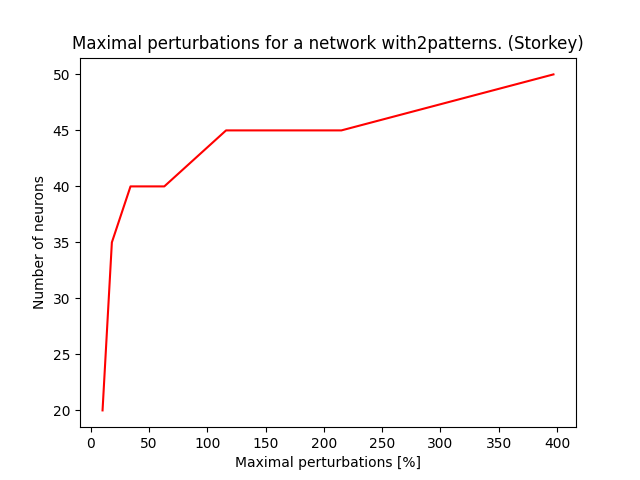
